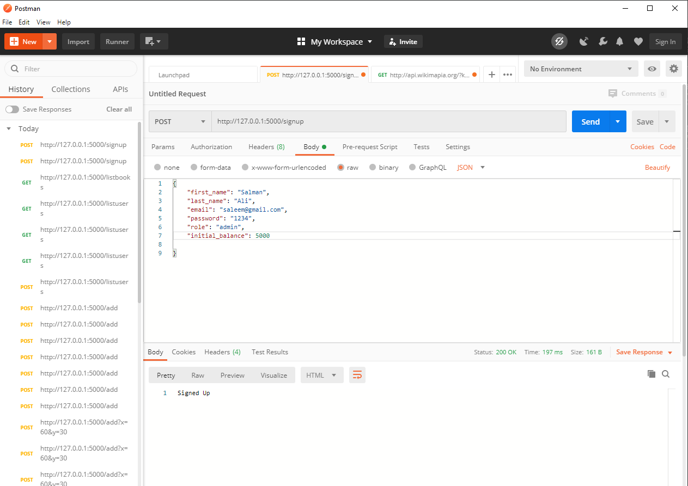

# BookStoreFlaskAPI
This is an flask API as we seen have seen in SimpleFlaskAPI, so it is better to use it with postman.
##What are endpoints and what type of data they accept?
### Endpoints and HTTP methods
```python
@app.route("/signup",methods=['GET','POST'])
@app.route("/listusers")
@app.route("/addbook",methods=['GET'])
@app.route('/listbooks')
@app.route("/purchasebook",methods=['GET','POST'])
@app.route("/allpurchasebooks")
```


### Data they accept
Accepts GET and POST, first_name and last_name variables should be present in raw data
```python
@app.route("/signup",methods=['GET','POST'])
def user_signup():
    input_data = request.get_json()
    first_name = input_data.get('first_name')
    last_name = input_data.get('last_name')
    admin = User(
        user_name = first_name + " " + last_name,
        email=input_data.get('email'),
        password=input_data.get('password'),
        role=input_data.get('role'),
        initial_balance = input_data.get('initial_balance')
    )
```
 
 
 
Accepts GET and returns list of all users
```python
@app.route("/listusers")
``` 


Accepts GET and returns list of all users
```python
@app.route("/listbooks")
``` 


* Adds Book into DB
```python
@app.route("/addbook",methods=['GET'])
def add_book():
    input_data = request.get_json()

    author_first_name=input_data.get('author_first_name')
    author_last_name=input_data.get('author_last_name')
    
    entry = Book(
        title = input_data.get('title'),
        author_name = author_first_name + " " + author_last_name,
        price = input_data.get('price'),
        pages = input_data.get('pages')
    )
    entry.add()
    
    return "Book is Added!"
```


Get Requests can be views in browser as JSON

 
See requirements.txt for detail

This application currently stores data in SQLlite, it can be easily modified to store it in any DB due to usage of SQLAlchemy ORM wrapper.
# Open SQLlite DB to view its content
1. You can use tools like https://www.sqlite.org/index.html or
2. You can open it in your PyCharm by:


### What If I want to call it with JS?
* You can call it as we did with SimpleFlaskAPI

### What about CORS error?
* This application is not CORS enabled, to enable it just paste following lines below app decleration in _app.py_
```python
@app.after_request
def after_request(response):
    response.headers.add('Access-Control-Allow-Origin', '*')
    response.headers.add('Access-Control-Allow-Headers', 'Content-Type,Authorization')
    response.headers.add('Access-Control-Allow-Methods', 'GET,PUT,POST,DELETE')
    return response
```
 
