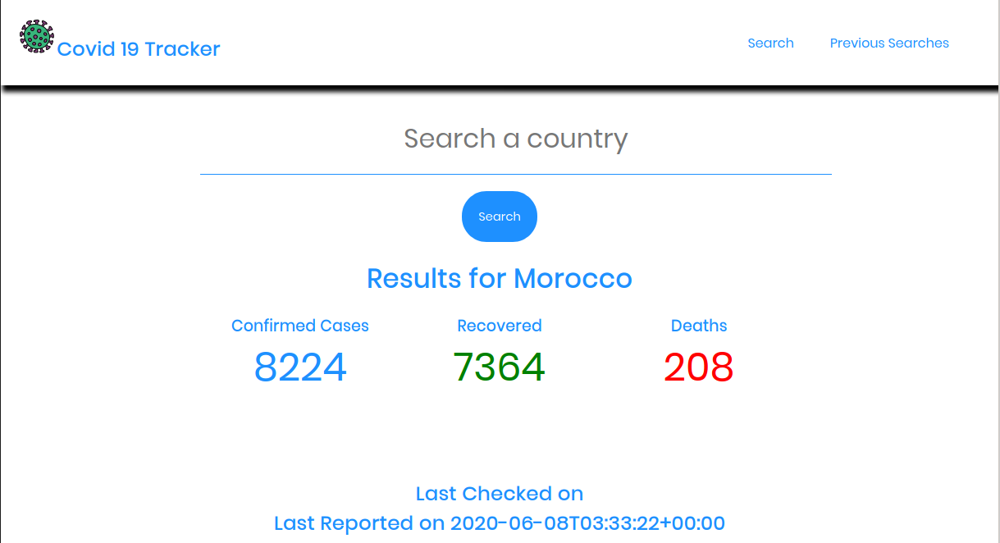
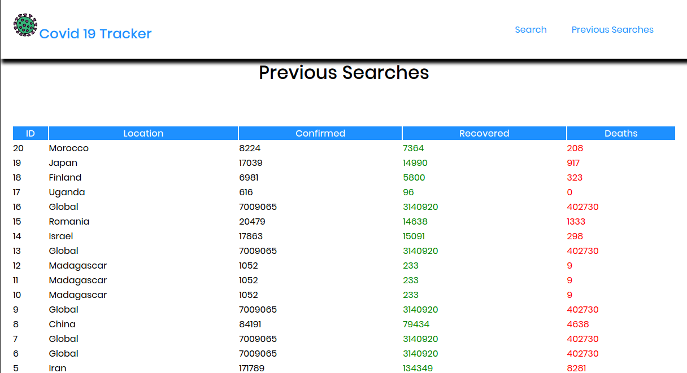

# Covid 19 Tracker
 This is an app that tracks information on Covid 19 basing on country.

## Built With
- Flask (the web framework)
- Requests (the library for making API calls)
- MySQL (for data persistence)
- HTML
- CSS

## API 

If you want to make your own, [The Api is here.](https://covid-19-coronavirus-statistics.p.rapidapi.com/v1/total)


## The live demo
[Production site](https://simple-deployment-demo.herokuapp.com/)

##### Create database named **_covid_**
To create table from Model, comment 2 commented lines in app.py. This will create table in DB, However once created you should disable these two lines.
```python
if __name__ == 'app':
	db.init_app(app=app) # Comment it after first run
	db.create_all(app=app) # Comment it after first run
	app.run(debug=True)
``` 


##### Chnage connection String
##### Create API key with RapidAPIs
##### Replace the key in app.py


## Install Project ependencies With
` pip3 install -r requirements.txt`

## Run With
` python 3 app.py `





