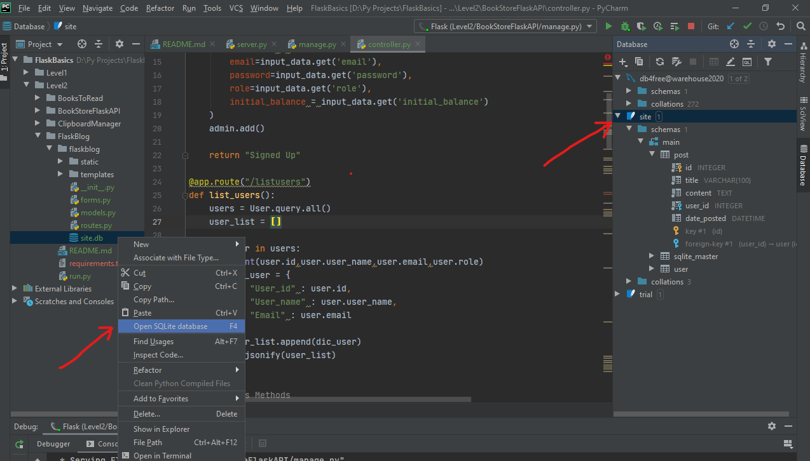

# Blogging-Website
This is a blogging website made using Flask

Frontend is made using 
1)Html5/CSS3
2)Bootstrap
3)Javascript

SQl-Alchemy is used for Database Management

1. pip install pillow
2. pip install flask-wtf
3. pip install flask-sqlalchemy
4. Flask-Bcrypt
5. Flask-Login

See requirements.txt for detail

This application currently stores data in SQLlite, it can be easily modified to store it in any DB due to usage of SQLAlchemy ORM wrapper.
# Open SQLlite DB to view its content
1. You can use tools like https://www.sqlite.org/index.html or
2. You can open it in your PyCharm by:

