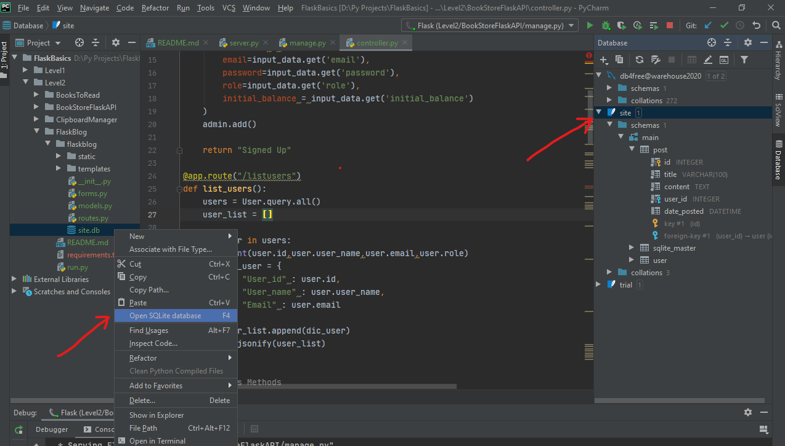

# ShareMedia

It is good example of creating services in flask and calling them in JS, it is incomplete.

This application currently stores data in SQLlite, it can be easily modified to store it in any DB due to usage of SQLAlchemy ORM wrapper.
# Open SQLlite DB to view its content
1. You can use tools like https://www.sqlite.org/index.html or
2. You can open it in your PyCharm by:

Dont waste more time debugging it. It is incomplete.
