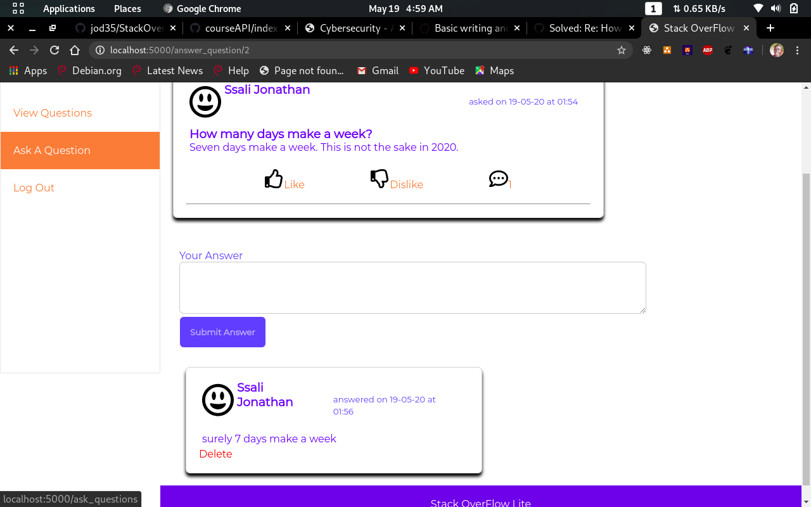

## StackOverFlow Lite

This is a simple clone of [StackOverFlow](https://stackoverflow.com).

## How it works

- Users ask questions
- Other users can answer the questions

## Built With
- Python3
- Flask framework
- MySQL (MariaDB)
- HTML & CSS (front-end)

## Demo

1. Create stack DB
2. Change connection string
3. run **_flask db upgrade_**