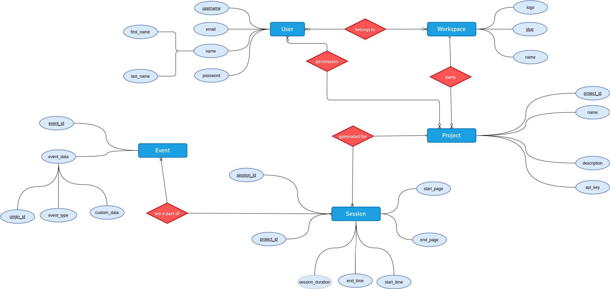

# TrailApp

Trail is a open-source user analytics and event tracking platform for your websites.
With Trail, you can get insights to how a user interacts with your site which helps you make informed
decisions in your development process.


#### Cool, is there a demo I can try?

Why, yes, we have our demo deployed on Heroku.
You can check it out [here](http://intense-ridge-31987.herokuapp.com/) with the credentials `test` and `test`.

A sample dashboard screenshot is here.


#### ER Diagram

The ER diagram of the database schema can be found below.



### Installation instructions

1. Clone this repo
```
git clone https://gitlab.com/SivagiriVisakan/trail-app.git
```
2. Initialize a `virtualenv` to seperate the dependencies for this project.
```
$ virtualenv trail-venv --python=python3
$ source trail-venv/bin/activate
$ pip install -r requirements.txt # install the dependencies
```

3. Make sure to set the credentials for the MySQL database in `example.env`
Create the schema as given the table.sql

4. Run the Flask application
```
$ flask run
```

5. If everything went good, then your site should be live at the URL localhost:5000

If you have trouble setting up, please feel free to open an issue at GitHub
